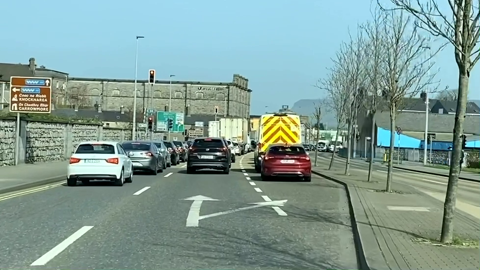
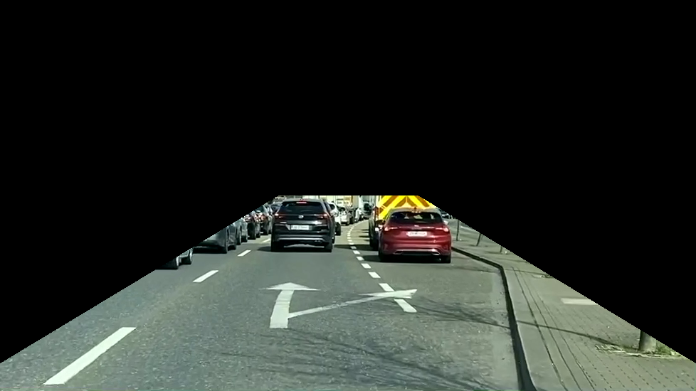
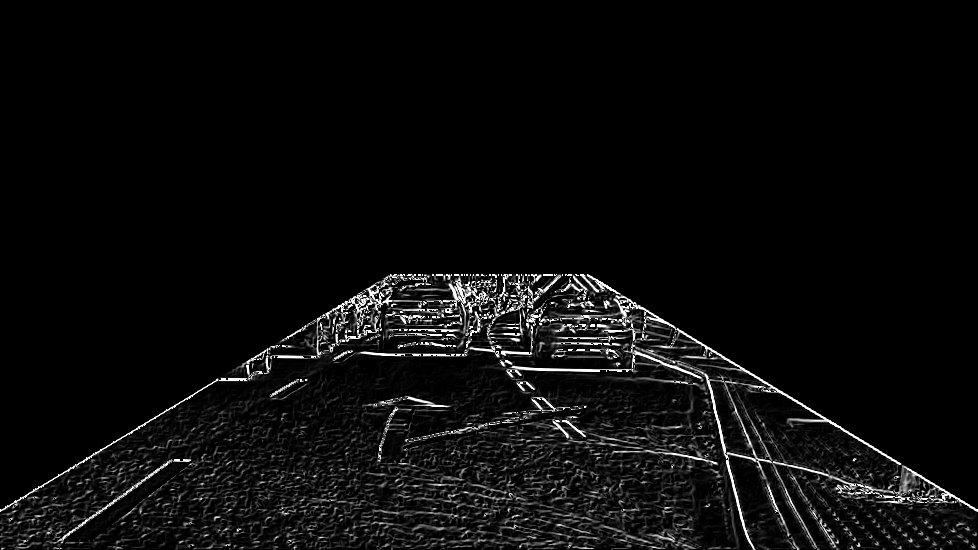
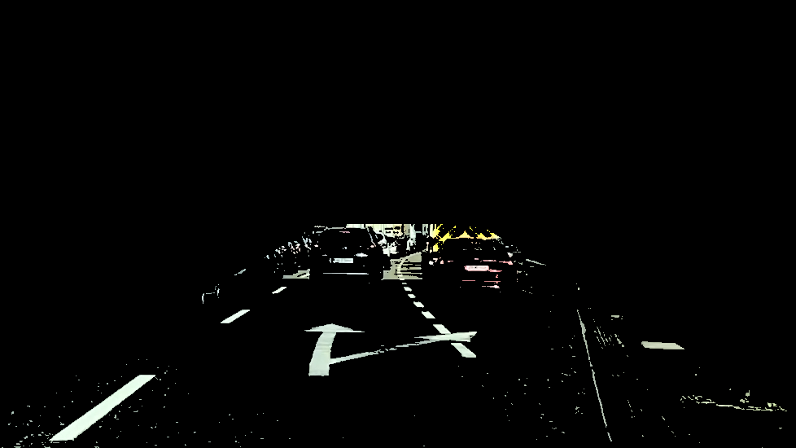
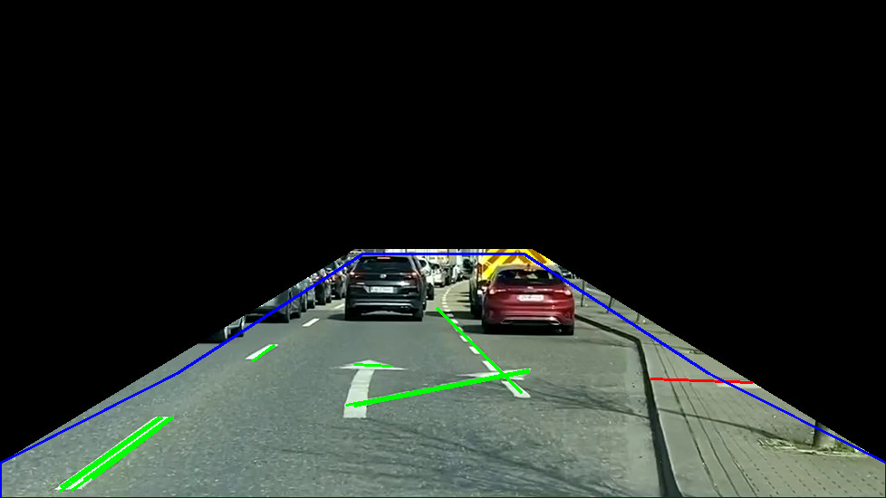
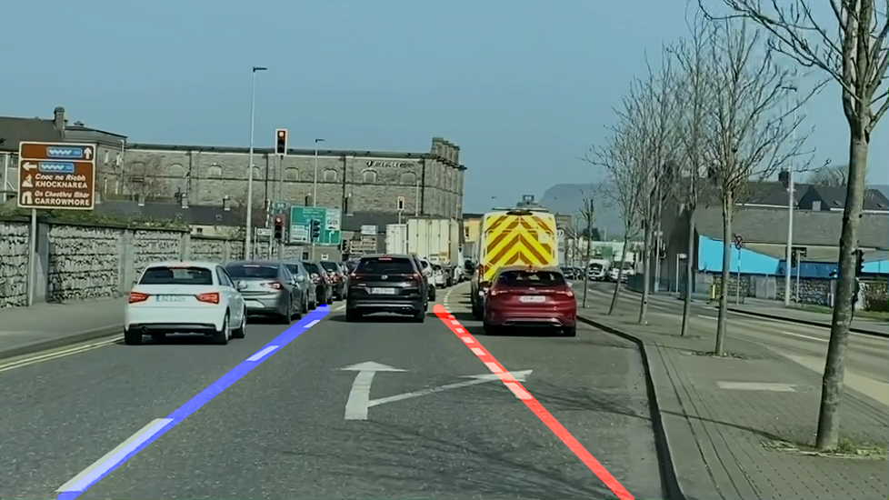
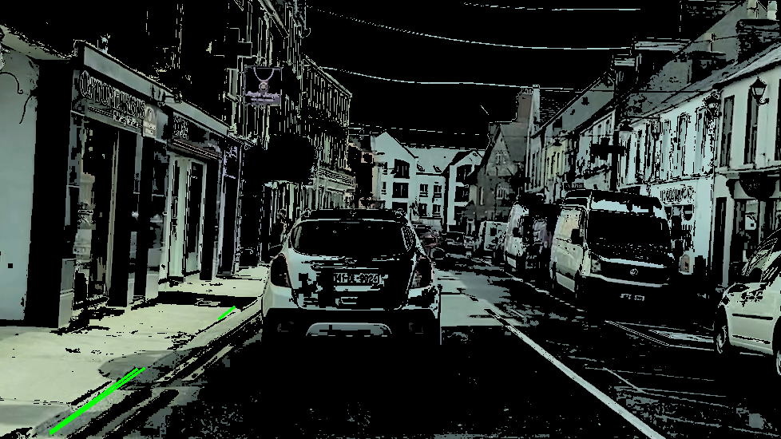
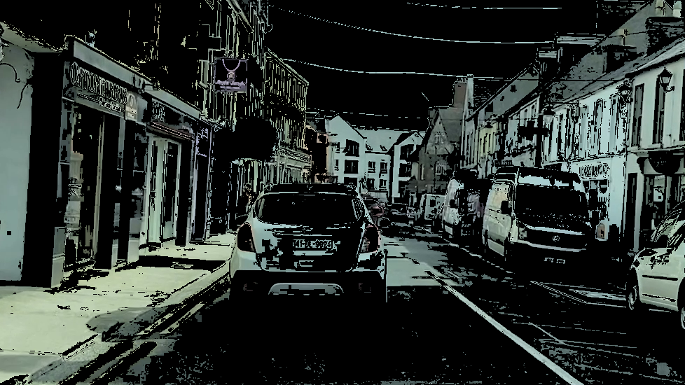
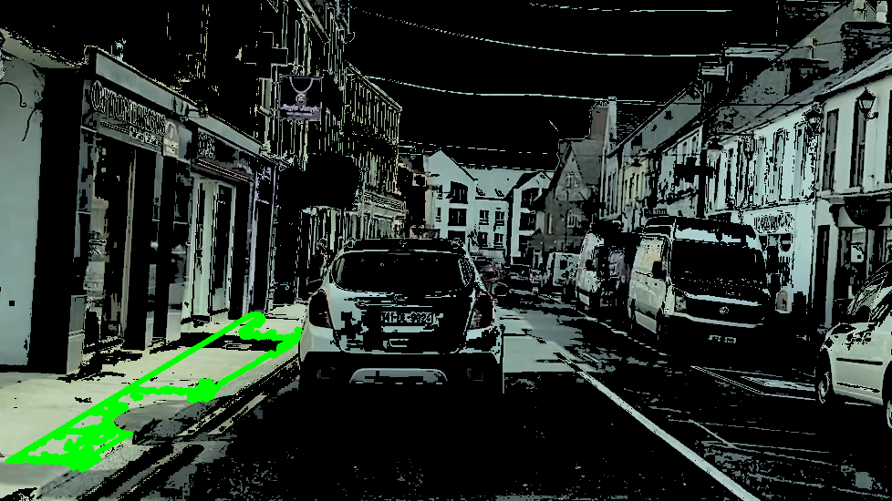
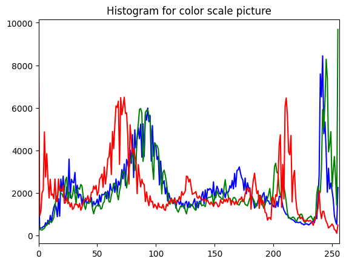

---
jupyter:
  colab:
  gpuClass: standard
  kernelspec:
    display_name: Python 3
    name: python3
  language_info:
    name: python
  nbformat: 4
  nbformat_minor: 0
---

::: {.cell .markdown id="Zd7HHVjTC9pc"}
# Machine-Vision-Lane-Detection and Recognition

Lane detection, recognition and segmentation are pivotal problems in the
automotive industry as mainstream autonomous vehicles (AV) teeter on the
precipice of market penetration. This code introduces a lane detection
method based on classical computer vision techniques which performs
robustly on a variety of lane-hand drive Irish roads. Data is extracted
from a video stream frame-by-frame, filtered and processed to find
likely lane markings and graphically represents these markings on the
original frames.


# Pre-Processing Pipeline

# Recognition Pipeline


:::

::: {.cell .code execution_count="1" colab="{\"base_uri\":\"https://localhost:8080/\",\"height\":0}" id="7HBrrk5IFVZT" outputId="7863505a-4256-4eeb-f104-873adce3277d"}
``` python
from google.colab import drive
colab_path = '/content/drive/'
video_path = colab_path + 'MyDrive/MVGCV/'
drive.mount(colab_path)
```

::: {.output .stream .stdout}
    Mounted at /content/drive/
:::
:::

::: {.cell .code execution_count="2" id="n1TS8zob7zS0"}
``` python
import matplotlib.pylab as plt
import cv2
import math
import numpy as np
```
:::

::: {.cell .code execution_count="3" id="BrSnU8yq_7k-"}
``` python
video = cv2.VideoCapture(video_path + 'DualcarriagewayAndTown.mp4')

# Check if video opened successfully
if (video.isOpened()== False):
    print("Error opening Video")
```
:::

::: {.cell .code execution_count="41" colab="{\"base_uri\":\"https://localhost:8080/\",\"height\":567}" id="l4kQcKfVE00j" outputId="f2b6747c-eb41-4c5e-b6f1-d908bcaef0d0"}
``` python
from google.colab.patches import cv2_imshow
# ret, frame = video.read()
ret = video.set( 1, 5000)
ret, frame = video.read()

if ret == True:
    cv2_imshow(frame)
```

::: {.output .display_data}

:::
:::

::: {.cell .code execution_count="42" colab="{\"base_uri\":\"https://localhost:8080/\",\"height\":567}" id="9qtABOXUYL3D" outputId="1208f759-04bb-4501-bded-742accc70c37"}
``` python
ysize,xsize = frame.shape[0:2]

# Create a trapezoidal area of interest
og_dx1 = int(0.0 * xsize)
og_dx2 = int(0.4 * xsize)

og_dy1  = int(0.5 * ysize)
og_dy2  = int(0.93 * ysize)
# calculate vertices for polygon of interest
vertices = np.array([[(og_dx1, ysize),
                      (og_dx1, og_dy2),
                      (og_dx2, og_dy1),
                      (xsize - og_dx2, og_dy1),
                      (xsize - og_dx1, og_dy2),
                      (xsize - og_dx1, ysize)
                      ]], dtype=np.int32)

# Define a blank mask
mask = np.zeros_like(frame)

# Fill in pixels inside the trapezoid
cv2.fillPoly(mask, vertices, color=(255,255,255))

# Mask the trapezoidal area
trapped_image = cv2.bitwise_and(frame, mask)
cv2_imshow(trapped_image)
```

::: {.output .display_data}

:::
:::

::: {.cell .code execution_count="43" colab="{\"base_uri\":\"https://localhost:8080/\",\"height\":567}" id="qH0V2r87S047" outputId="834d494b-efd2-4900-a276-3baccdf0b25e"}
``` python
grey = cv2.cvtColor(trapped_image,cv2.COLOR_BGR2GRAY)
# blur = cv2.GaussianBlur(gray,(1,1),1000)

sobel_x_filter = cv2.Sobel(grey, ddepth=-1, dx=1, dy=0, scale=1, borderType=cv2.BORDER_DEFAULT)
sobel_y_filter = cv2.Sobel(grey, ddepth=-1, dx=0, dy=1, scale=1, borderType=cv2.BORDER_DEFAULT)

# scharr_x_filter = cv2.Scharr(grey, ddepth=-1, dx=1, dy=0, scale=1, borderType=cv2.BORDER_DEFAULT)
# scharr_y_filter = cv2.Scharr(grey, ddepth=-1, dx=0, dy=1, scale=1, borderType=cv2.BORDER_DEFAULT)


sobel_filter = sobel_x_filter + sobel_y_filter
# scharr_filter = scharr_x_filter + scharr_y_filter
cv2_imshow(sobel_filter)
# cv2_imshow(scharr_filter)
```

::: {.output .display_data}

:::
:::

::: {.cell .code execution_count="44" colab="{\"base_uri\":\"https://localhost:8080/\",\"height\":567}" id="aegc2YZdWT1S" outputId="e795448b-9f5c-4891-bd75-2604667cf0fa"}
``` python
hls_frame = cv2.cvtColor(trapped_image,cv2.COLOR_BGR2HLS)

hls_mask = cv2.inRange(hls_frame, (0,160,0), (359,255,255))

hls_masked_image = cv2.bitwise_and(frame,frame, mask=hls_mask)
cv2_imshow(hls_masked_image)
```

::: {.output .display_data}

:::
:::

::: {.cell .code execution_count="45" id="Jld2H3Mebhmx"}
``` python
hls_grey = cv2.cvtColor(hls_masked_image,cv2.COLOR_BGR2GRAY)
combined_image = cv2.bitwise_and(sobel_filter, hls_grey)
# cv2_imshow(combined_image)
```
:::

::: {.cell .code execution_count="46" id="P8gEiYDLo4-j"}
``` python
# Prepocess
# gray = cv2.cvtColor(combined_image,cv2.COLOR_BGR2GRAY)
blur = cv2.GaussianBlur(combined_image,(1,1),1000)
flag, thresh = cv2.threshold(blur, 0, 255, cv2.THRESH_BINARY)

# Taking a matrix of size 2 as the kernel
kernel = np.ones((2,2), np.uint8)

# The first parameter is the original image,
# kernel is the matrix with which image is
# convolved and third parameter is the number
# of iterations, which will determine how much
# you want to erode/dilate a given image.
img_erosion = cv2.erode(thresh, kernel, iterations=1)
img_dilation = cv2.dilate(img_erosion, kernel, iterations=1)
img_erosion1 = cv2.erode(img_dilation, kernel, iterations=1)
img_dilation2 = cv2.dilate(img_erosion1, kernel, iterations=1)
# img_erosion2 = cv2.erode(img_dilation2, kernel, iterations=1)
# img_dilation3 = cv2.dilate(img_erosion2, kernel, iterations=1)
# img_erosion3 = cv2.erode(img_dilation3, kernel, iterations=1)


# cv2_imshow(combined_image)
# cv2_imshow(img_dilation2)
```
:::

::: {.cell .code execution_count="47" colab="{\"base_uri\":\"https://localhost:8080/\",\"height\":567}" id="_dP9bNaVWuBc" outputId="8820caa8-cfb0-499c-ea8c-bcdff094369f"}
``` python
# Create a smaller trapezoidal area of interest
dx1 = int(0.00 * xsize)
dx2 = int(0.41 * xsize)
dy  = int(0.51 * ysize)

step_factor = 0.5
step_offset = ((og_dx2 - dx2)**2 + (og_dy1-dy)**2)**0.5

og_dy2  = int(0.93 * ysize)

# calculate vertices for augmented trapezoid
shrunk_vertices = np.array([[(dx1,                                        ysize),
                             (dx1,                                        og_dy2),
                             (og_dx2*step_factor,                         (ysize-og_dy1)/2+og_dy1),
                            #  (og_dx2*step_factor + step_offset,           (ysize-og_dy)/2+og_dy),
                             (dx2,                                        dy),
                             (xsize - dx2,                                dy),
                            #  (xsize - og_dx2*step_factor - step_offset,   (ysize-og_dy)/2+og_dy),
                             (xsize - og_dx2*step_factor,                 (ysize-og_dy1)/2+og_dy1),
                             (xsize - dx1,                                og_dy2),
                             (xsize - dx1,                                ysize)
                             ]], dtype=np.int32)


# Find Edges and Apply Hough Transform for lines
edges = cv2.Canny(img_dilation2,0,255,apertureSize = 3)
lines = cv2.HoughLinesP(edges,1,np.pi/180,50,minLineLength=20,maxLineGap=50)

img = trapped_image.copy()
final_lines = []

# Plot all lines in red
for line in lines:
    x1,y1,x2,y2 = line[0]
    cv2.line(img,(x1,y1),(x2,y2),(0,0,255),2)

# Plot filtered lines in green
for line in lines:
    x1,y1,x2,y2 = line[0]
    if (0 <= cv2.pointPolygonTest(shrunk_vertices, (float(x1),float(y1)), True)) and (0 <= cv2.pointPolygonTest(shrunk_vertices, (float(x2),float(y2)), True)):
      cv2.line(img,(x1,y1),(x2,y2),(0,255,0),2)
      final_lines.append(line)

# Plot Polyline filter in blue
cv2.polylines(img,shrunk_vertices,True,(255,0,0),2)

cv2_imshow(img)
```

::: {.output .display_data}

:::
:::

::: {.cell .code execution_count="48" colab="{\"base_uri\":\"https://localhost:8080/\",\"height\":585}" id="6PBzV68Mpmom" outputId="07c2ff25-9c55-4d30-b9b2-6adcd00b9dad"}
``` python
CACHE_LEFT_SLOPE = 0
CACHE_RIGHT_SLOPE = 0
CACHE_LEFT = [0, 0, 0]
CACHE_RIGHT = [0, 0, 0]

drawn_img = np.zeros_like(frame)

draw_lines(drawn_img, final_lines, (255,0,0), (0,0,255))

processed_img = cv2.addWeighted(frame, 0.8, drawn_img, 1, 0)

cv2_imshow(processed_img)
```

::: {.output .stream .stdout}
    296.98484809834997
:::

::: {.output .display_data}

:::
:::

::: {.cell .code execution_count="50" id="YzwWgDdqphNr"}
``` python
def draw_lines(img, lines,color_left,color_right,thickness=12):

    global CACHE_LEFT_SLOPE
    global CACHE_RIGHT_SLOPE
    global CACHE_LEFT
    global CACHE_RIGHT

    # DECLARE VARIABLES
    cache_weight = 0.9

    right_ys = []
    right_xs = []
    right_slopes = []

    left_ys = []
    left_xs = []
    left_slopes = []

    r_thresh = img.shape[1] *.4
    l_thresh = img.shape[1] *.6

    bottom_of_image = img.shape[0]

    for line in lines:
        for x1,y1,x2,y2 in line:
            slope, yint = np.polyfit((x1, x2), (y1, y2), 1)
            # Filter lines using slope and x position
            if .3 < np.absolute(slope) <= 3:
                if slope > 0 and x1 > r_thresh and x2 > r_thresh:
                    right_ys.append(y1)
                    right_ys.append(y2)
                    right_xs.append(x1)
                    right_xs.append(x2)
                    right_slopes.append(slope)
                elif slope < 0 and x1 < l_thresh and x2 < l_thresh:
                    left_ys.append(y1)
                    left_ys.append(y2)
                    left_xs.append(x1)
                    left_xs.append(x2)
                    left_slopes.append(slope)


    # DRAW RIGHT LANE LINE
    if right_ys:
        right_index = right_ys.index(min(right_ys))
        right_x1 = right_xs[right_index]
        right_y1 = right_ys[right_index]
        right_slope = np.median(right_slopes)
        if CACHE_RIGHT_SLOPE != 0:
            right_slope = right_slope + (CACHE_RIGHT_SLOPE - right_slope) * cache_weight

        right_x2 = int(right_x1 + (bottom_of_image - right_y1) / right_slope)

        if CACHE_RIGHT_SLOPE != 0:
            right_x1 = int(right_x1 + (CACHE_RIGHT[0] - right_x1) * cache_weight)
            right_y1 = int(right_y1 + (CACHE_RIGHT[1] - right_y1) * cache_weight)
            # right_x2 = int(right_x2 + (CACHE_RIGHT[2] - right_x2) * cache_weight)

        length = ((right_x1-right_x2)**2+(bottom_of_image-right_y1)**2)**0.5
        # print(length)
        if (250 > length):
          phi = math.atan(right_slope)
          right_y1 = int(bottom_of_image - 250*math.sin(phi))
          right_x1 = int(right_x2 - 250*math.cos(phi))

        CACHE_RIGHT_SLOPE = right_slope
        CACHE_RIGHT = [right_x1, right_y1, right_x2]


    # DRAW LEFT LANE LINE
    if left_ys:
        left_index = left_ys.index(min(left_ys))
        left_x1 = left_xs[left_index]
        left_y1 = left_ys[left_index]
        left_slope = np.median(left_slopes)
        if CACHE_LEFT_SLOPE != 0:
            left_slope = left_slope + (CACHE_LEFT_SLOPE - left_slope) * cache_weight

        left_x2 = int(left_x1 + (bottom_of_image - left_y1) / left_slope)

        if CACHE_LEFT_SLOPE != 0:
            left_x1 = int(left_x1 + (CACHE_LEFT[0] - left_x1) * cache_weight)
            left_y1 = int(left_y1 + (CACHE_LEFT[1] - left_y1) * cache_weight)
            left_x2 = int(left_x2 + (CACHE_LEFT[2] - left_x2) * cache_weight)

        CACHE_LEFT_SLOPE = left_slope
        CACHE_LEFT = [left_x1, left_y1, left_x2]

    # Interception code
    if left_ys and right_ys:
        x_intersect = (left_slope*left_x2 - right_slope*right_x2)/(left_slope - right_slope)
        y_intersect = left_slope*(x_intersect - left_x2) + bottom_of_image

        left_int_length = ((left_x2-x_intersect)**2+(bottom_of_image-y_intersect)**2)**0.5
        right_int_length = ((right_x2-x_intersect)**2+(bottom_of_image-y_intersect)**2)**0.5

        left_length = ((left_x1-left_x2)**2+(bottom_of_image-left_x1)**2)**0.5
        right_length = ((right_x1-right_x2)**2+(bottom_of_image-right_y1)**2)**0.5

        if (left_int_length >= left_length):
          phi = math.atan(left_slope)
          left_y1 = int(bottom_of_image + left_int_length*0.8*math.sin(phi))
          left_x1 = int(left_x2 + left_int_length*0.8*math.cos(phi))

        print(right_length)
        if (right_int_length <= right_length):
          phi = math.atan(right_slope)
          right_y1 = int(bottom_of_image - right_int_length*0.8*math.sin(phi))
          right_x1 = int(right_x2 - right_int_length*0.8*math.cos(phi))

    if left_ys:
      cv2.line(img, (left_x1, left_y1), (left_x2, bottom_of_image), color_left, thickness)
    if right_ys:
      cv2.line(img, (right_x1, right_y1), (right_x2, bottom_of_image), color_right, thickness)
```
:::

::: {.cell .code id="ISTKIenUFBEh"}
``` python
video.release()
# Closes all the frames
cv2.destroyAllWindows()
```
:::

::: {.cell .markdown id="9Pch8qx1Ir5E"}
# Rough Work and Ideas from this point on
:::

::: {.cell .code execution_count="51" id="kXmIa_7elK_0"}
``` python
ysize,xsize = frame.shape[0:2]

# Create a trapezoidal area of interest
dx1 = int(0.0 * xsize)
dx2 = int(0.4 * xsize)
dy = int(0.4 * ysize)
# calculate vertices for trapezoid
vertices = np.array([[(dx1, ysize), (dx2, dy), (xsize - dx2, dy), (xsize - dx1, ysize)]], dtype=np.int32)

# Converting image to grayscale
grey = cv2.cvtColor(frame, cv2.COLOR_BGR2GRAY)

# Applying a gaussian blur mask on the gray image
blur = cv2.GaussianBlur(grey, (5, 5), 0)

# detecting edges in the image
edges = cv2.Canny(blur, 25, 100)

# Defining the region  of interest
mask = np.zeros_like(edges)
cv2.fillPoly(mask, vertices, 255)
masked = cv2.bitwise_and(edges, mask)

mask = np.zeros_like(frame).astype(np.uint8)
cv2.fillPoly(mask, [vertices], (255,255,255))
img_r_2= cv2.bitwise_and(mask,frame)

new_img=cv2.bitwise_and(img_r_2,img_r_2,mask=masked)
new_img=cv2.cvtColor(new_img, cv2.COLOR_BGR2GRAY)

# Performing Hough transform to detect lanes
lines = cv2.HoughLinesP(new_img, 1, np.pi/180, 40, np.array([]), minLineLength=200, maxLineGap=50)
hough_image = np.zeros((*new_img.shape, 3), dtype=np.uint8)

# for line in lines:
#     x1,y1,x2,y2 = line[0]
#     cv2.line(img_r_2,(x1,y1),(x2,y2),(0,255,0),2)
# cv2_imshow(masked)
```
:::

::: {.cell .code execution_count="52" id="0o85w9lPm9KY"}
``` python
# Source points for homography.
bird_eye_coords_= np.float32([[410,335], [535, 334], [780, 479], [150, 496]])
# bird_eye_coords_=np.float32([[422,321],[540,330],[790,485],[80,500]])
# Destination points for homography
world_coords_ = np.float32([[50, 0], [250, 0], [250, 500], [0, 500]])

h_, mask = cv2.findHomography( bird_eye_coords_,world_coords_,cv2.RANSAC,5.0)

warped = cv2.warpPerspective(masked,h_,(300,600),flags=cv2.INTER_LINEAR)
```
:::

::: {.cell .code execution_count="53" colab="{\"base_uri\":\"https://localhost:8080/\",\"height\":567}" id="fyLFCJUZcMtj" outputId="07058b5e-7497-416b-8b34-41897c03462f"}
``` python
# gray = cv2.cvtColor(img_erosion3,cv2.COLOR_BGR2GRAY)
# blur = cv2.GaussianBlur(gray,(1,1),1000)
# flag, thresh = cv2.threshold(blur, 80, 255, cv2.THRESH_BINARY)
edges = cv2.Canny(img_dilation2,0,255,apertureSize = 7)
lines = cv2.HoughLinesP(edges,1,np.pi/180,100,minLineLength=10,maxLineGap=15)
imgHoughed = target.copy()
for line in lines:
    x1,y1,x2,y2 = line[0]
    cv2.line(imgHoughed,(x1,y1),(x2,y2),(0,255,0),2)
cv2_imshow(imgHoughed)
```

::: {.output .display_data}

:::
:::

::: {.cell .code execution_count="18" colab="{\"base_uri\":\"https://localhost:8080/\",\"height\":567}" id="KNIMU1hNX6eN" outputId="c6e60cfd-0dcd-4166-f9a4-8b121417595b"}
``` python
hsv_frame = cv2.cvtColor(frame,cv2.COLOR_BGR2HSV)

# Mask the grey of the tarmac
hsv_frame = cv2.GaussianBlur(hsv_frame,(1,1),1000)
mask = cv2.inRange(hsv_frame, (0,10,30), (179,50,210))

target = cv2.bitwise_and(frame,frame, mask=mask)
cv2_imshow(target)
```

::: {.output .display_data}

:::
:::

::: {.cell .code execution_count="19" colab="{\"base_uri\":\"https://localhost:8080/\",\"height\":567}" id="8KyggCVWixJi" outputId="47caa1cc-0aa8-4730-b43c-b9cd245ad259"}
``` python
# Prepocess
# gray = cv2.cvtColor(target,cv2.COLOR_BGR2GRAY)
# blur = cv2.GaussianBlur(gray,(1,1),1000)
# flag, thresh = cv2.threshold(blur, 80, 255, cv2.THRESH_BINARY)
# Find contours
contours, hierarchy = cv2.findContours(combined_image,cv2.RETR_TREE,cv2.CHAIN_APPROX_SIMPLE)
contours = sorted(contours, key=cv2.contourArea,reverse=True)
# Select long perimeters only
perimeters = [cv2.arcLength(contours[i],True) for i in range(len(contours))]
listindex=[i for i in range(15) if perimeters[i]>perimeters[0]/2]
numcards=len(listindex)
# Show image
imgcont = target.copy()
[cv2.drawContours(imgcont, [contours[i]], 0, (0,255,0), 5) for i in listindex]
cv2_imshow(imgcont)
```

::: {.output .display_data}

:::
:::

::: {.cell .code execution_count="20" colab="{\"base_uri\":\"https://localhost:8080/\",\"height\":452}" id="-gJAL7HUG3d2" outputId="7a2b3f37-f667-4583-c255-175d2cb148bd"}
``` python

height, width, depth = frame.shape

color = ('b','g','r')
for channel,col in enumerate(color):
    histr = cv2.calcHist([frame],[channel],None,[256],[0,256])
    plt.plot(histr,color = col)
    plt.xlim([0,256])
plt.title('Histogram for color scale picture')
plt.show()
```

::: {.output .display_data}

:::
:::

::: {.cell .code execution_count="21" id="-wD5VJDVf0WW"}
``` python
def draw_lines(image, lines, color=[255, 0, 0], thickness=2):
    for line in lines:
        for x1,y1,x2,y2 in line:
            cv2.line(image, (x1, y1), (x2, y2), color, thickness)
```
:::

::: {.cell .markdown id="2xh5iMc1uA9H"}
## Inspirations and sources

-   <https://github.com/bharadwaj-chukkala/Road-Lanes-detection-and-Turn-Prediction-using-Sliding-Window-Algorithm/blob/master/Lane_Detection.py>
-   <https://github.com/silenc3502/PyOCVLaneDetect/blob/master/P1.ipynb>
-   <https://github.com/silenc3502/PyAdvancedLane/blob/master/doit.ipynb>
-   <https://www.sciencedirect.com/science/article/pii/S2214785320373302?casa_token=9_yFfncWoRIAAAAA:LoAM-vsl4Sb2JOpQ2cYtQyZY7sadoVVX5wIujeV3-rHMFDT6AljVKooSvG-BQZH_51Ro2LwJng#f0040>
-   <https://medium.com/@ldesegur/a-lane-detection-approach-for-self-driving-vehicles-c5ae1679f7ee>
-   <https://opencv.org/evaluating-opencvs-new-ransacs/>
:::
